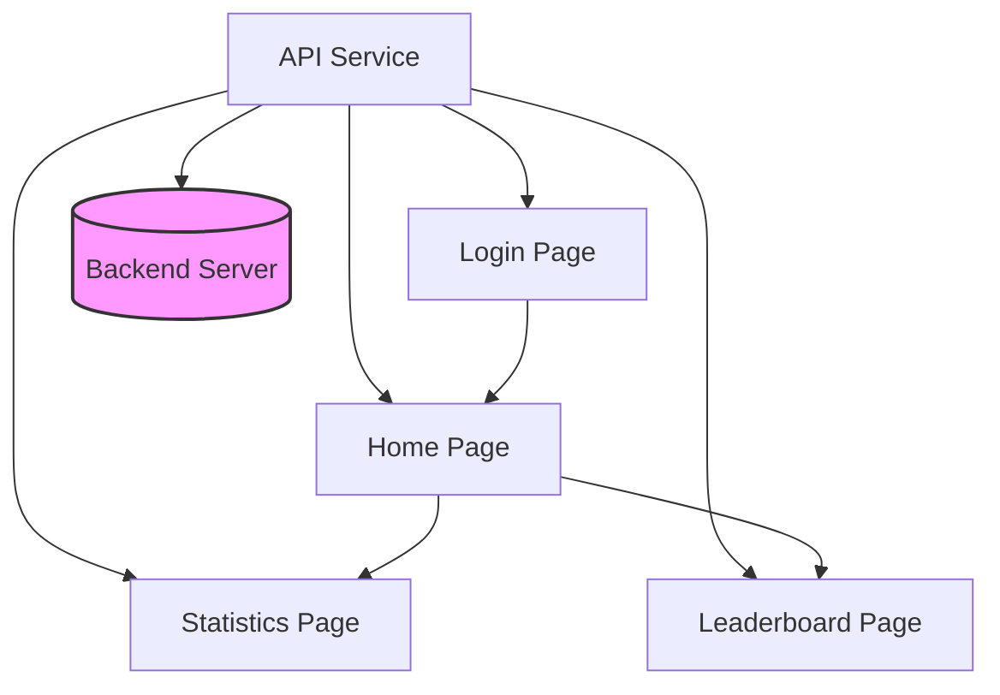

# FloraFocus App

Een mobiele applicatie die gebruikers helpt bij het scannen van plantenzaden, het bijhouden van statistieken, en het bekijken van een ranglijst op basis van het aantal gescande zaden. FloraFocus ondersteunt gebruikers met een overzichtelijk profiel en biedt eenvoudige navigatie tussen verschillende functionaliteiten.

## Inhoudsopgave
- [Architectuur](#architectuur)
- [Functionaliteiten](#functionaliteiten)
  - [Login Page](#login-page)
  - [Home Page](#home-page)
  - [Statistics Page](#statistics-page)
  - [Leaderboard Page](#leaderboard-page)
  - [Products Page](#products-page)
  - [Image Target Page](#image-target-page)
- [API Service](#api-service)
- [Beveiliging](#beveiliging)
- [API Endpoints](#api-endpoints)

## Architectuur

De app maakt gebruik van een service-gestuurde architectuur om communicatie met de backend te beheren en gegevens efficiënt te laden. Dit wordt weergegeven in het volgende diagram:

## Functionaliteiten

### Login Page

De loginpagina ondersteunt gebruikers om in te loggen of een nieuw account aan te maken.

- **Login Flow**: Gebruikers vullen hun email en wachtwoord in. Indien succesvol, worden ze doorgestuurd naar de Home Page.
- **Registratie Flow**: Gebruikers kunnen een nieuw account aanmaken door hun email en wachtwoord in te voeren. Na succesvolle registratie worden ze geïnformeerd over het succes of falen.
- **Email Validatie**: Implementeert regex-based validatie voor email formats
- **Wachtwoord Validatie**: Vereist minimaal 6 karakters voor nieuwe accounts
- **Error Handling**: Toont gebruiksvriendelijke foutmeldingen via SnackBars

### Home Page

Na het inloggen komen gebruikers op de Home Page. Hier kunnen zij navigeren naar verschillende functies zoals statistieken, ranglijst en producten.

**Functionaliteiten:**
- Welkomstbericht met gebruikersnaam
- Een zwevende knop voor de camera om producten te scannen
- **Logout Functionaliteit**: Via LogoutButton in de AppBar
- **Navigatie Grid**: Vier hoofdfuncties met custom styling en Montserrat font
- **User Provider Integration**: Gebruikt Provider pattern voor gebruikersstatus

### Statistics Page

Geeft een overzicht van de gescande producten per gebruiker.

- **Data Flow**: Maakt verbinding met de backend om real-time data op te halen en de statistieken bij te werken.
- **Functionaliteiten**:
  - Toont gescande producten met SKU-code
  - Real-time data-updates en visuele statistieken
  - **Visual Feedback**: Gebruikt icons om gescande/niet-gescande producten aan te duiden
  - **Real-time Updates**: Synchroniseert met backend via ApiService
  

### Leaderboard Page

Toont een ranglijst van gebruikers gebaseerd op het aantal gescande producten.

- **Ranking Systeem**: Gebruikers worden gesorteerd op basis van het aantal gescande producten.
- **Functionaliteiten**:
  - Rangschikking per gebruiker met gebruikersnaam en aantal gescande producten
  - Real-time updates van de ranglijst

### Products Page

- **Product Lijst**: Alfabetisch gesorteerde lijst van alle beschikbare producten
- **Detail Weergave**: Toont product naam, categorie, prijs en SKU
- **Categorie Support**: Ondersteunt VEGETABLE en FRUIT categorieën

### Image Target Page

- **Unity Integratie**: Gebruikt flutter_unity_widget voor AR scanning
- **Product Detectie**: Ondersteunt specifieke SKU codes (bijv. APPLE001, PEAR001)
- **Real-time Feedback**: Directe feedback bij succesvolle scans

## API Service

De ApiService-klasse verzorgt alle communicatie met de backend. Enkele kernfuncties zijn:

- `fetchUsers()`: Haalt alle gebruikers op voor de ranglijst
- `loginUser()`: Authenticeert gebruikers
- `fetchUserProducts()`: Haalt producten op voor een specifieke gebruiker
- `fetchProductBySku()`: Zoekt een product op basis van SKU-code
- `updateUserData()`: Werkt gebruikersprofielgegevens bij
- `addProductToUserBySku()`: Registreert gescande producten voor gebruikers
- `getProductBySku()`: Haalt specifieke productdetails op

## Beveiliging

De app implementeert basisbeveiliging voor gegevensvalidatie en veilig gebruik van API's.

- **Email Validatie**: Controleert of het ingevoerde email-formaat geldig is
- **Veilige API-endpoints**: Beschermde endpoints voor gebruikersgegevens

## API Endpoints

| Methode | Endpoint | Beschrijving |
|---------|----------|--------------|
| GET | `/users` | Haalt alle gebruikers op |
| GET | `/users/{id}` | Haalt een specifieke gebruiker op |
| POST | `/api/user` | Maakt een nieuwe gebruiker aan |
| PUT | `/user/{id}` | Bijwerken van gebruikersgegevens |
| GET | `/products/all` | Haalt alle producten op |
| GET | `/products?skuCode={sku}` | Zoekt een product op SKU |